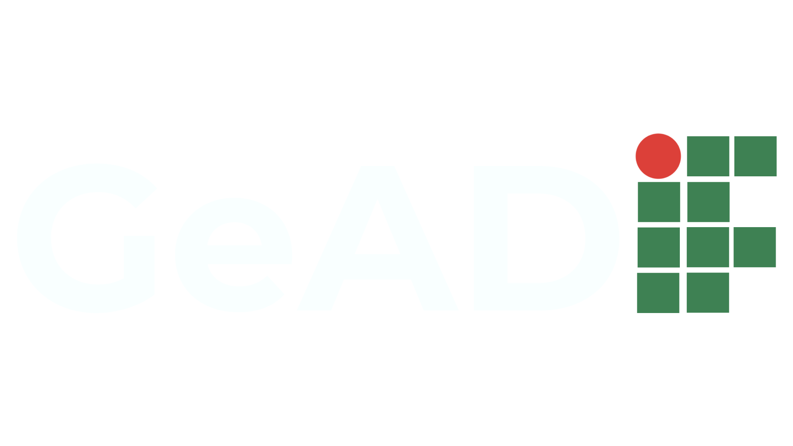

  
   
  <em>Automatizando e otimizando a avaliação docente no IFTO</em>

 

    
    
    
    

 

## 📖 Sobre o Projeto

O **GeAD (Gestão de Avaliação Docente)** é um sistema desenvolvido para **automatizar o processo de avaliação de desempenho docente** no IFTO, substituindo o uso de formulários manuais no Google Forms.

Ele garante **segurança, automação e centralização dos dados**, além de otimizar a geração e envio de relatórios de forma prática e confiável.

